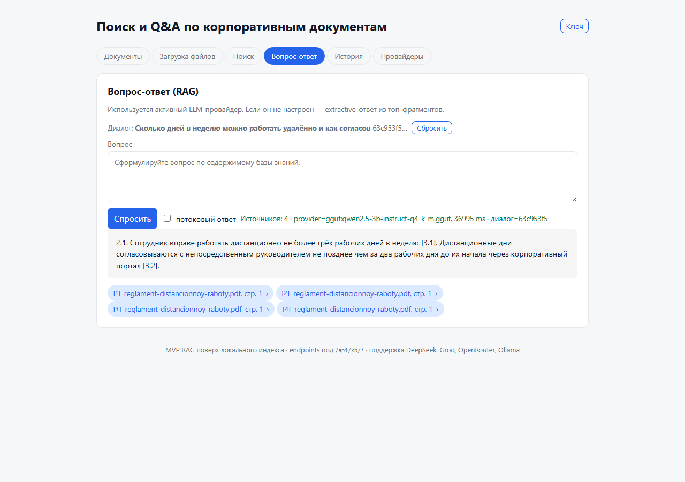
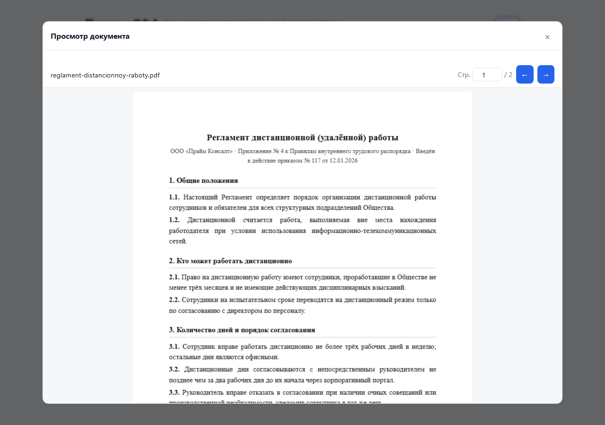
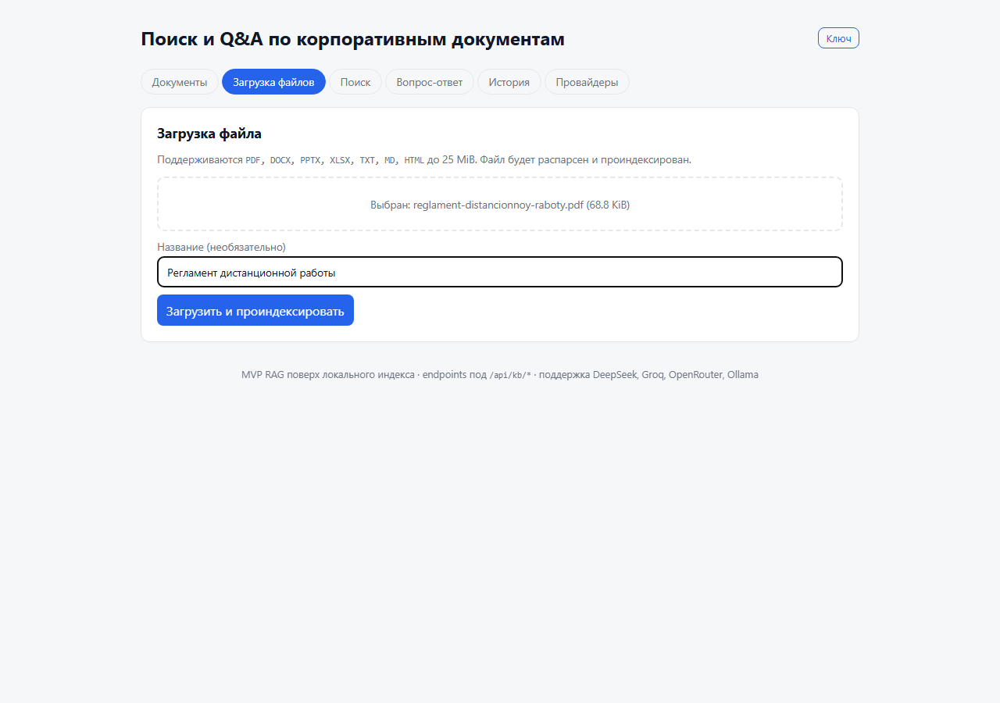

# KB.AI — корпоративная база знаний с нейропоиском


[](https://opensource.org/licenses/Apache-2.0)

Self-hosted AI-помощник по корпоративным документам. Загружаете PDF / DOCX / XLSX / PPTX —
получаете ответы с цитатами из ваших файлов и кликабельным переходом к нужной странице
с подсветкой фрагмента. Полностью на вашем сервере: ни одного запроса в зарубежные облака
не уходит, если вы того не настроите.



## Быстрый старт

```bash
git clone https://github.com/aiprocadm/baza_znaniy_ai.git
cd baza_znaniy_ai
docker compose -f compose.yml up -d --build
# Откройте http://localhost/
# Загрузите PDF, дождитесь индексации, спросите.
```

Без Docker (Linux/macOS):

```bash
git clone https://github.com/aiprocadm/baza_znaniy_ai.git
cd baza_znaniy_ai
bash install.sh
# Откройте http://localhost:8000/
```

После запуска — загружайте документы во вкладке «Документы», задавайте вопросы во вкладке
«Вопрос-ответ». Цитаты в ответе кликабельны и открывают PDF в встроенном вьювере с
автоматической подсветкой фрагмента.

## Что внутри

- **RAG-пайплайн на FastAPI:** Docling для layout-aware парсинга → semantic chunking →
  hashing/Ollama/OpenAI-API эмбеддинги → SQLite-вектор-стор → опциональный
  cross-encoder reranker (BAAI/bge-reranker-v2-m3 для русского) → LLM с цитатами.
- **PDF citation viewer:** клик на цитату `[файл.pdf, стр. 12]` открывает модальное окно
  с PDF.js и подсветкой фрагмента через find API.
- **6 LLM-провайдеров из коробки:** DeepSeek, Groq, OpenRouter, OpenAI, Ollama, и любой
  OpenAI-совместимый custom endpoint. Auto-detect через `.env` без перезапуска.
- **Streaming SSE-ответы:** токены приходят на клиент по мере генерации; multi-turn
  диалоги с памятью в SQLite.
- **kb-cli ops:** `kb-cli backup / restore / reindex / health` для операций без UI.
- **i18n-ready UI:** все строки вынесены в `data/www/i18n/ru.json`; переключение на
  другие CIS-языки — добавление JSON-файла.





## Не для вас если

- У вас уже есть Notion AI / MS Copilot и вы довольны — мы не лучше для general-purpose.
- Вы хотите multi-tenant SaaS — KB.AI single-tenant. Для каждой команды/компании —
  отдельная инсталляция.
- У вас > 1М документов — SQLite-стор начнёт скрипеть. Используйте `app/api/v1/*`
  (legacy mature path с Qdrant) или дождитесь Phase 2 hybrid stack.
- Вам нужен SLA — это side-project под Apache-2.0, поддержка best-effort через GitHub Issues.

## Configuration

Базовый `.env`:

```env
# LLM (выберите один; auto-priority DeepSeek > Groq > OpenRouter > OpenAI)
DEEPSEEK_API_KEY=sk-...

# Опционально: реальный embedder (по умолчанию hashing fallback)
KB_EMBEDDINGS_BACKEND=ollama
OLLAMA_EMBED_MODEL=nomic-embed-text

# Опционально: API key для всех mutating endpoints
KB_API_KEY=$(openssl rand -hex 32)
```

> **Перед прогоном eval-харнесса** (`scripts/eval_rag.py generate` / `run`)
> настройте реальный embedder — Ollama (`KB_EMBEDDINGS_BACKEND=ollama` +
> `OLLAMA_EMBED_MODEL`) или API (`KB_EMBEDDINGS_BACKEND=api` +
> `EMBEDDINGS_API_BASE_URL`). На hashing fallback метрики near-random, поэтому
> `run` намеренно откажется стартовать (`app/eval/guards.py:ensure_real_embedder`;
> `--allow-hashing` — только для одноразового smoke-прогона). Переключение
> backend'а требует реиндекса: `kb-cli reindex --embedder <name>`.

Подробный список переменных, продвинутая конфигурация (LoRA, llama.cpp, Qdrant,
Postgres) — см. [`docs/legacy_README.md`](docs/legacy_README.md).

## Operations

`kb-cli` — операции без браузера:

```bash
kb-cli backup var/backups/$(date +%F).tar.gz   # бэкап KB
kb-cli restore var/backups/2026-05-01.tar.gz   # восстановление
kb-cli reindex --embedder hash                  # миграция эмбеддера
kb-cli health                                    # health-check для cron
```

Установить как entry-point — `pip install -e .` (см. install.sh).

## Архитектура

- **Source-of-truth API entrypoint:** `app/api/main.py` (инициализирует
  `app/core/app.py:create_app`). Контейнеры/CI пинят `uvicorn app.api.main:app`.
- **Source-of-truth runtime path:** `app/` (API, ingestion, worker, retrieval, LLM, встроенный UI).
- **UI active branch:** `frontend/` — primary web UI. `data/www/` — встроенная
  диагностическая Operations Console.

См. [`docs/architecture.md`](docs/architecture.md) — два HTTP-пути (`/api/kb/*` MVP
single-tenant и `/api/v1/*` mature multi-tenant), почему они параллельны, и когда
их объединять.

## Roadmap

См. [`ROADMAP.md`](ROADMAP.md) — что **НЕ** планируем (anti-roadmap из vision'а),
и при каких условиях это меняется.

## Contributing

См. [`CONTRIBUTING.md`](CONTRIBUTING.md). TL;DR: TDD, Conventional Commits,
`ruff + black + pytest` зелёные, маленькие PR.

## Security

См. [`SECURITY.md`](SECURITY.md). Reports → aiproc.adm@gmail.com. Нет bug bounty;
30-day grace period перед публикацией patch'а.

## License

Apache-2.0. См. [`LICENSE`](LICENSE).

## Legacy / advanced

Старый разработческий README (LoRA training, llama.cpp setup, full env-var reference,
Operations Console) — [`docs/legacy_README.md`](docs/legacy_README.md).
